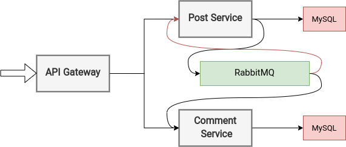
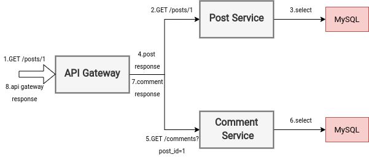
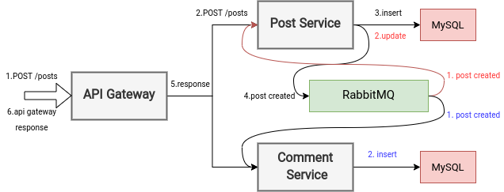
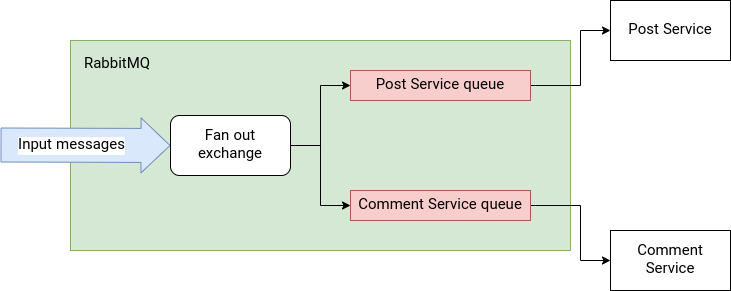

# Microservices Architecture example using symfony

here's our orchestration of the components:

Let's explore this 2 scenarios:

1. get a singular post with its comments (read request)
2. submit a post (write request)

## 1. Get a singular post with its comments (read request)

Read requests are pretty much straightforward we query any services that are needed and return the merged response, 
just note that these sequences doesn't need to be exactly in this order, for example requests can be made concurrently for 
performance purposes, Now lets get into the steps in this case:
1. The client sends an HTTP GET request to the API Gateway
2. The API Gateway sends a GET request to the Post service 
3. the post service queries its own database and gets the record
4. the Post Service returns the Post data as response to the Api Gateway
5. the Api Gateway sends a get request to the Comment Service to get the commends of that post
6. the Comment Service queries its own database to get the comments related to that post
7. the Comment Service returns the response to the Api Gateway
8. the Api Gateway merges the responses of those two services and returns it as the final singular response to the client.

## 2. Submit a post (write request)

Here we are gonna demonstrate how services can communicate through Pub\Sub style queue, then for sake of example we made
two imaginary tasks on the Post and Comment services, in the Post Service we are gonna pretend to mine a text to store 
on each model and on the Comment service we are gonna create a comment for that post that keeps the original Post content, 
rest of the steps are pretty much straightforward REST implementation.
1. the client sends an HTTP POST request to the API Gateway 
2. the Api Gateway sends a POST request to the Post Service
3. the Post Service runs an insert query to store the post inside its own database
4. the Post Service publishes an Event(Message) to RabbitMQ more on this later.
5. the Post Service returns a response to the Api Gateway with the inserted post
6. the Api Gateway returns the Post Service's response to the client

###### The RabbitMQ part

So here we can see the details inside the RabbitMQ, in the step 4 of the write request we sent a PostCreated event to 
the RabbitMQ let's continue form there, in order to receive that message on multiple ends we can use a fan-out exchange
instead of a normal queue on the sender's end, the symfony messenger is not aware of this and thinks of it as a normal 
queue and we are gonna consume the messages from another queue that gets the message after the fanout stage. so when the
exchange receives a message duplicates it to any queues that we have specified and multiple services consumes the same 
messages. after that as we discussed before inside the Post Service the event handler updates the post with an imaginary
mined text and in the Comment Service we create a copy of the Post by inserting a comment for that post.
